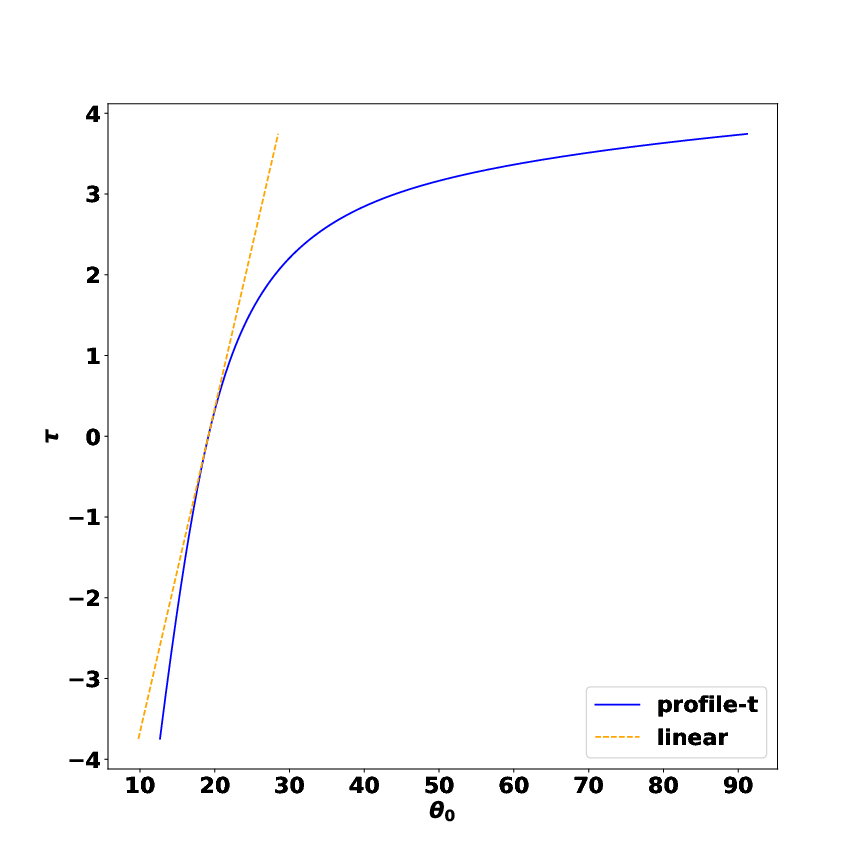
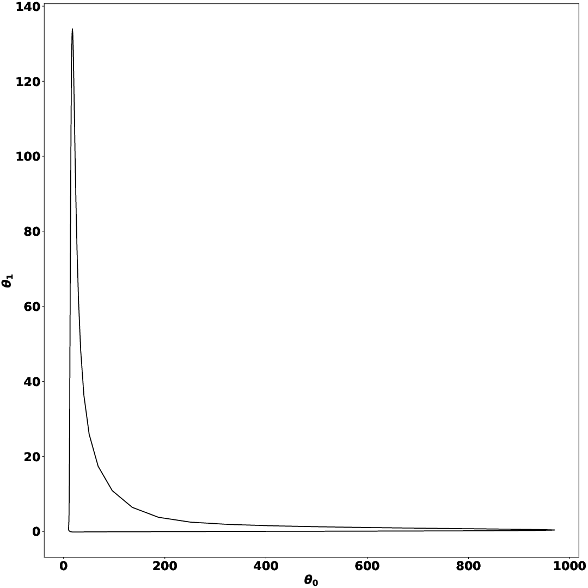
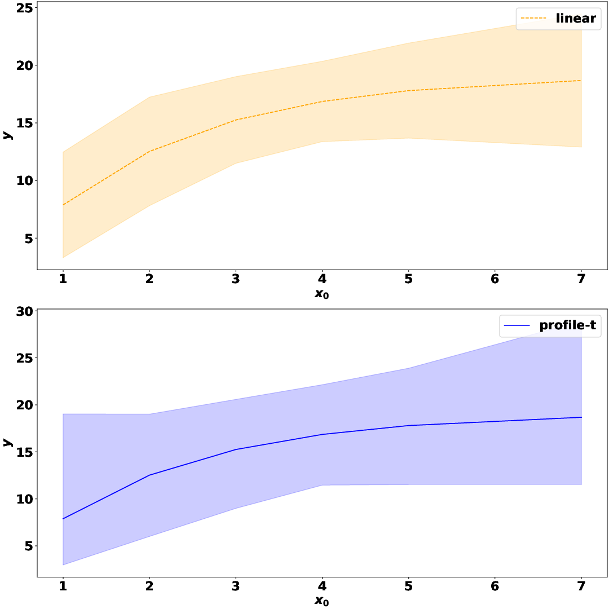

**profile_t** is a Python module for calculating confidence intervals of nonlinear regression models.

Quantification of uncertainty of regression models is important for the interpretation of models and for decision making. The linear approximation and likelihood profiles are well-known possibilities for the calculation of confidence and prediction intervals for nonlinear regression models.

This module allows the calculation of confidence regions of the numerical parameters and the prediction interval for any nonlinear regression model compatible with sympy. It provides helper functions to build the sympy-expressions from a string representation of the model and some support plots to analyse the model.

The tau-theta plot shows the nonlinearity of the confidence interval of each parameter:

<p align="center">

</p>

The theta-theta plot shows the relationship between a pair of numerical parameters:

<p align="center">

</p>

The prediction interval shows the uncertainties around the predictions of the training data:

<p align="center">

</p>

More information available at the paper:

```bibtex
    @article{
    }
```


# Installation

## Dependencies

profile_t requires:

- Python
- NumPy
- SciPy
- SymPy
- Matplotlib

=======

## User installation

To install from source, first clone this github repository and then run:

```bash
pip install -U .
```

Or from pypy:

```bash
pip install -U profile_t
```

## Changelog

See the `Changelog` file for the last changes.

## Examples of usage

The folder `examples` contain some examples of usage of this module.

## Documentation

The documentation is available at [link](link).

## Testing

You can test the module with the `test_profile.py` script in the `tests` folder.

## Citation

TODO

## AUTHORS

- Fabricio Olivetti de Franca <folivetti (at) ufabc.edu.br>
- Gabriel Kronberger <Gabriel.Kronberger (at) fh-hagenberg.at>

A joint work of:

<table border="0">
 <tr>
    <td><a href="https://pesquisa.ufabc.edu.br/hal/index.html" target="_blank"></a> Heuristics, Analysis and Learning Laboratory (HAL)</td>
    <td><a href="https://heal.heuristiclab.com/" target="_blank"></a> Heuristics and Evolutionary Algorithms Laboratory (HEAL)</td>
 </tr>
</table>